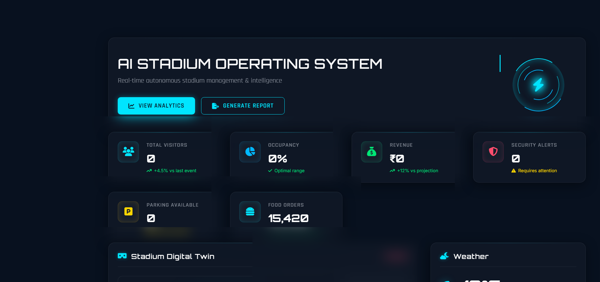
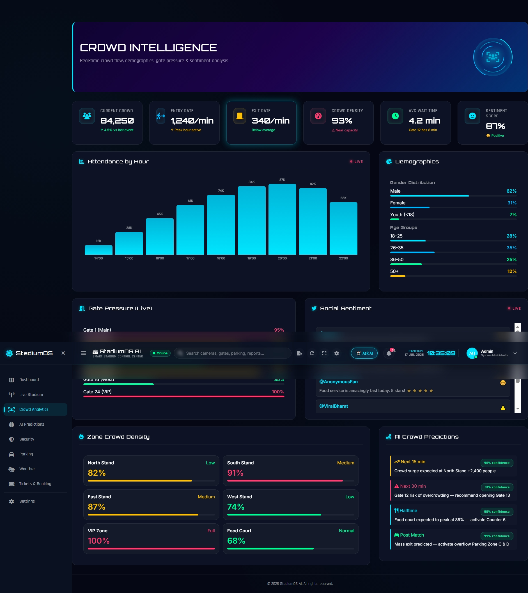
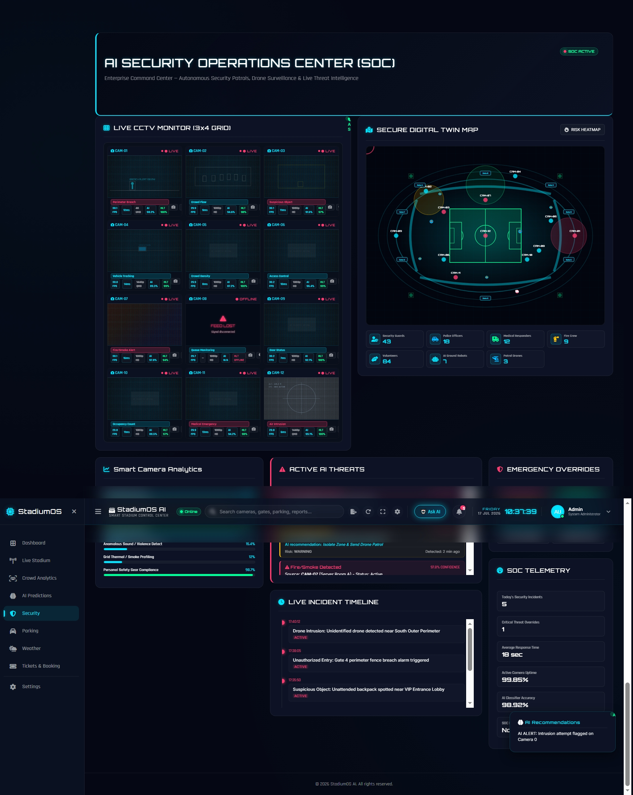
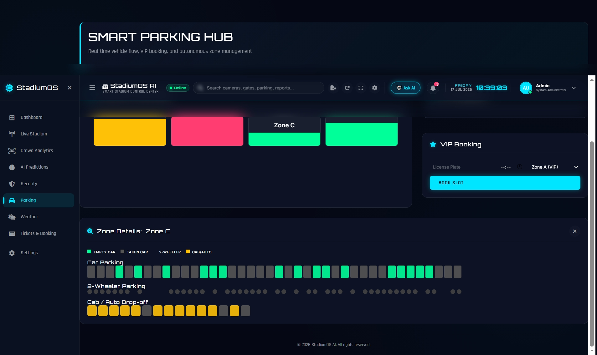

<div align="center">

# 🏟️ StadiumOS AI

### AI-Powered Smart Stadium Operating System

*Transforming Stadium Operations with Artificial Intelligence, Real-Time Analytics, and Intelligent Automation.*

<br>


<br>


---

## 🚀 Intelligent Stadium Management Dashboard

### **Real-Time Monitoring • Crowd Intelligence • AI Analytics • Smart Parking • Security Intelligence • Weather Monitoring • Ticket Management**

### *Building the Future of Intelligent Stadium Operations.*

</div>

---

# 📖 Overview

**StadiumOS AI** is a next-generation **AI-powered Smart Stadium Operating System** designed to modernize stadium management through intelligent automation, real-time monitoring, predictive analytics, and centralized operational control.

Traditional stadium management relies on multiple disconnected systems for crowd monitoring, parking, ticketing, weather tracking, and security operations. StadiumOS AI integrates these services into a **single intelligent dashboard**, allowing administrators to monitor and manage every aspect of stadium operations efficiently.

The platform demonstrates how **Artificial Intelligence, Data Visualization, REST APIs, and Modern Web Technologies** can work together to improve operational efficiency, enhance visitor safety, optimize resource allocation, and support faster decision-making.

---

# ❗ Problem Statement

Managing a modern stadium is a highly complex task involving thousands of visitors, multiple operational teams, security personnel, parking systems, ticketing platforms, and environmental monitoring.

Most stadiums operate using separate management systems that do not communicate effectively with one another, creating several operational challenges.

These challenges include:

- 🚶 Crowd congestion during entry and exit
- 🚗 Inefficient parking management
- 🛡 Delayed response to security incidents
- 🎟 Difficulty monitoring ticket occupancy
- 🌦 Weather-related operational risks
- 📊 Lack of centralized operational analytics
- ⚡ Slow decision-making due to scattered information
- 💰 Inefficient resource utilization

Without an integrated platform, administrators struggle to make fast and informed operational decisions.

---

# 💡 Solution

**StadiumOS AI** solves these challenges by providing a centralized AI-powered management platform that combines all major stadium services into one intelligent dashboard.

The system enables administrators to:

- 📊 Monitor live stadium operations
- 👥 Analyze crowd movement and occupancy
- 🚗 Track parking availability in real time
- 🛡 Monitor security alerts and incidents
- 🎟 Manage ticketing and seating information
- 🌦 View live weather intelligence
- 📈 Analyze operational performance through interactive dashboards
- 🤖 Demonstrate AI-inspired analytics and intelligent decision support

By integrating multiple operational systems into a unified platform, StadiumOS AI improves efficiency, enhances safety, optimizes resource allocation, and delivers a smarter stadium management experience.

---

# ✨ Key Features

## 📊 AI Operations Dashboard

A centralized dashboard that provides administrators with a complete real-time overview of stadium operations.

### Features

- Live Stadium Statistics
- Operational KPIs
- Revenue Analytics
- Visitor Tracking
- Occupancy Monitoring
- Interactive Charts
- Performance Insights
- Live Activity Feed

---

## 👥 Crowd Intelligence

Monitor visitor movement and crowd behavior across the stadium.

### Features

- Crowd Density Analysis
- Entry & Exit Monitoring
- Occupancy Heat Mapping
- Zone-wise Visitor Tracking
- Attendance Analytics
- Real-Time Crowd Visualization

---

## 🛡 Security Intelligence

Advanced monitoring interface for security teams.

### Features

- Incident Dashboard
- Threat Detection Alerts
- Security Notifications
- Activity Timeline
- Emergency Monitoring
- Security Status Indicators

---

## 🚗 Smart Parking Management

Monitor and optimize stadium parking operations.

### Features

- Live Parking Availability
- Zone Management
- VIP Parking
- Vehicle Distribution
- Capacity Monitoring
- Parking Utilization Analytics

---

## 🎟 Smart Ticket Management

Monitor seating availability and ticket status.

### Features

- Ticket Dashboard
- VIP Booking Status
- Seat Availability
- Seating Visualization
- Booking Analytics
- Occupancy Reports

---

## 🌦 Weather Intelligence

Integrated weather monitoring for operational planning.

### Features

- Live Weather
- Hourly Forecast
- Weekly Forecast
- Wind Speed
- Rain Probability
- Temperature Monitoring
- Weather Alerts

---

# 🧠 Artificial Intelligence Concepts

Although StadiumOS AI is a demonstration platform, it showcases how AI can improve stadium management through intelligent analytics and decision support.

The project demonstrates:

- 🤖 AI-Powered Dashboard
- 📈 Predictive Analytics
- 👥 Crowd Intelligence
- 📊 Real-Time Data Visualization
- 🧠 Decision Support Systems
- 🚦 Operational Intelligence
- 📍 Smart Resource Monitoring
- ⚡ Intelligent Alert Management
- 📉 Performance Analytics
- 🌐 Smart Stadium Automation

---

# 🎯 Objectives

The primary objectives of StadiumOS AI are:

- Improve stadium operational efficiency
- Enhance visitor safety
- Centralize stadium management
- Demonstrate AI-driven analytics
- Provide real-time operational insights
- Support intelligent decision-making
- Optimize parking utilization
- Improve crowd management
- Enhance security monitoring
- Showcase modern dashboard development

---

# 🌟 Why StadiumOS AI?

✅ Modern Glassmorphism Dashboard

✅ Responsive User Interface

✅ AI-Inspired Analytics

✅ Real-Time Monitoring

✅ Express.js Backend APIs

✅ Automated Testing

✅ GitHub Actions CI/CD

✅ Interactive Visualizations

✅ Modular Project Architecture

✅ Professional Dashboard Experience

---

# 🎖 Project Highlights

- 🏟 Smart Stadium Operating System
- 🤖 AI-Driven Dashboard
- 📊 Interactive Analytics
- 👥 Crowd Intelligence
- 🚗 Smart Parking
- 🎟 Ticket Monitoring
- 🛡 Security Dashboard
- 🌦 Weather Intelligence
- 📈 Real-Time Insights
- ⚡ REST API Integration
- 🧪 Automated Testing
- 🚀 CI/CD Ready

---# 🏗️ System Architecture

```text
                           👤 Stadium Administrator
                                      │
                                      ▼
                     ┌────────────────────────────────┐
                     │      StadiumOS AI Dashboard    │
                     │ (HTML • CSS • JavaScript UI)   │
                     └────────────────────────────────┘
                                      │
                    ┌─────────────────┼─────────────────┐
                    │                 │                 │
                    ▼                 ▼                 ▼
          Crowd Intelligence   Smart Parking    Security Center
                    │                 │                 │
                    └──────────────┬──┴─────────────────┘
                                   ▼
                         Express.js REST API Server
                                   │
             ┌─────────────────────┼─────────────────────┐
             ▼                     ▼                     ▼
      Weather API          Dashboard APIs          Authentication
                                   │
                                   ▼
                          Stadium Analytics Engine
                                   │
                                   ▼
                        Real-Time Decision Support
```

---

# ⚙️ Technology Stack

## Frontend

| Technology | Purpose |
|------------|----------|
| HTML5 | Application Structure |
| CSS3 | Responsive Styling |
| JavaScript (ES6) | Client-side Logic |
| Glassmorphism UI | Modern Dashboard Design |

---

## Backend

| Technology | Purpose |
|------------|----------|
| Node.js | Runtime Environment |
| Express.js | REST API Development |
| CORS | Cross-Origin Resource Sharing |
| Helmet | Security Headers |
| Express Rate Limit | API Rate Limiting |

---

## Testing

| Technology | Purpose |
|------------|----------|
| Jest | Unit Testing |
| Supertest | API Testing |

---

## DevOps

| Technology | Purpose |
|------------|----------|
| Git | Version Control |
| GitHub | Source Code Hosting |
| GitHub Actions | Continuous Integration |

---

# 📂 Project Structure

```text
stadium-os-ai-v2
│
├── .github/
│   └── workflows/
│       └── test.yml
│
├── backend/
│   ├── tests/
│   ├── package.json
│   ├── package-lock.json
│   └── server.js
│
├── public/
│   ├── favicon.svg
│   └── icons.svg
│
├── src/
│   ├── assets/
│   ├── components/
│   │   └── settings/
│   ├── context/
│   ├── pages/
│   ├── styles/
│   ├── utils/
│   ├── index.jsx
│   ├── script.js
│   └── settings.jsx
│
├── index.html
├── package.json
├── package-lock.json
└── README.md
```

---

# 🚀 Getting Started

## Clone Repository

```bash
git clone https://github.com/nensi25/stadium-os-ai-v2.git
```

---

## Navigate to Project

```bash
cd stadium-os-ai-v2
```

---

## Install Backend Dependencies

```bash
cd backend
npm install
```

---

## Run Development Server

```bash
npm start
```

The backend server will start on:

```text
http://localhost:5000
```

---

## Run Automated Tests

```bash
npm test
```

---

# 🔌 REST API Endpoints

| Method | Endpoint | Description |
|---------|----------|-------------|
| GET | `/` | Welcome API |
| POST | `/api/login` | User Authentication |
| GET | `/api/dashboard` | Dashboard Statistics |
| GET | `/api/weather` | Weather Information |
| GET | `/api/parking` | Parking Status |
| POST | `/api/chat` | AI Chat Endpoint |

---

# 🧪 Testing

The project includes automated backend API testing using **Jest** and **Supertest**.

### Covered Tests

- API Response Validation
- Login Authentication
- Dashboard API
- Parking API
- Weather API
- AI Chat API
- Error Handling

Run all tests:

```bash
npm test
```

---

# ⚡ Continuous Integration

GitHub Actions automatically performs:

- Dependency Installation
- Test Execution
- Build Validation
- Code Verification

Every push to the **main** branch automatically triggers the CI workflow.

---

# 🌐 Live Demo

### Web Application

> 🔗 **Netlify Deployment**

```
https://YOUR-NETLIFY-LINK.netlify.app
```

---

### GitHub Repository

```
https://github.com/nensi25/stadium-os-ai-v2
```

---

## 📸 Project Screenshots

### 🏠 Dashboard Overview


---

### 👥 Crowd Intelligence


---

### 🛡 Security Center


---

### 🚗 Smart Parking


---

# 📊 Repository Statistics

| Category | Details |
|-----------|---------|
| Project Type | Smart Stadium Management System |
| Architecture | Frontend + REST API Backend |
| Version | 1.0 |
| Status | Active Development |
| Platform | Web Application |
| Backend | Express.js |
| Testing | Jest + Supertest |
| CI/CD | GitHub Actions |
| License | MIT |

---

# 🔒 Security Features

- Helmet Security Middleware
- Express Rate Limiter
- Protected REST APIs
- Secure Request Handling
- Error Management
- Backend Validation

---

# ⚡ Performance Highlights

- Responsive Interface
- Lightweight Frontend
- Fast REST APIs
- Modular Components
- Optimized JavaScript
- Modern CSS Layout
- Smooth User Experience

---# 💡 Future Scope

StadiumOS AI has been designed as a scalable platform with the potential to integrate advanced Artificial Intelligence, IoT, and Cloud technologies for next-generation stadium management.

### Planned Enhancements

- 🤖 AI Chat Assistant
- 🎥 Computer Vision Crowd Detection
- 😊 Facial Recognition Entry System
- 🚨 Emergency Response Automation
- 📡 IoT Sensor Integration
- ☁️ Cloud-Based Infrastructure
- 📱 Android & iOS Mobile Application
- 🛰 Digital Twin Stadium
- 📊 AI Predictive Maintenance
- 🎟 Blockchain-Based Ticket Verification
- 🚗 AI Smart Traffic Routing
- ⚡ Energy Consumption Monitoring
- 🌍 Multi-Stadium Management
- 🎤 Voice-Controlled Dashboard
- 📍 Indoor Navigation System

---

# 🗺️ Project Roadmap

## ✅ Phase 1

- Responsive Dashboard
- Crowd Monitoring
- Security Dashboard
- Smart Parking
- Ticket Dashboard
- Weather Dashboard
- REST APIs
- Backend Integration
- Automated Testing

---

## 🚀 Phase 2

- User Authentication
- Database Integration
- Real-Time Notifications
- Analytics Dashboard
- Report Generation
- Role-Based Access Control

---

## 🤖 Phase 3

- Machine Learning Analytics
- AI Predictions
- Smart Alerts
- Computer Vision
- Digital Twin
- IoT Sensors

---

## 🌍 Phase 4

- Cloud Deployment
- Mobile Application
- Multi-Stadium Support
- AI Assistant
- Predictive Maintenance

---

# 🎯 Use Cases

StadiumOS AI can be used in various large-scale venues and smart infrastructure projects.

### Sports

- 🏏 Cricket Stadiums
- ⚽ Football Stadiums
- 🏀 Basketball Arenas
- 🎾 Tennis Complexes
- 🏐 Indoor Sports Centers

---

### Entertainment

- 🎤 Concert Venues
- 🎭 Event Centers
- 🎪 Exhibition Halls
- 🎬 Live Performance Venues

---

### Public Infrastructure

- 🏙 Smart Cities
- 🏛 Convention Centers
- 🛫 Airports
- 🚉 Railway Stations
- 🎡 Public Gathering Areas

---

# 🌟 Key Project Highlights

✅ AI-Powered Dashboard

✅ Modern Glassmorphism Design

✅ Responsive Layout

✅ REST API Backend

✅ Express.js Server

✅ Modular Architecture

✅ GitHub Actions CI

✅ Automated Testing

✅ Interactive Analytics

✅ Security Monitoring

✅ Smart Parking

✅ Weather Intelligence

✅ Ticket Management

✅ Crowd Analytics

✅ Professional Documentation

---

# 📊 Why StadiumOS AI?

| Feature | Benefit |
|----------|----------|
| AI Dashboard | Centralized Stadium Monitoring |
| Crowd Intelligence | Better Visitor Management |
| Smart Parking | Efficient Vehicle Allocation |
| Security Center | Faster Incident Response |
| Weather Intelligence | Improved Operational Planning |
| Ticket Management | Better Occupancy Tracking |
| REST APIs | Scalable Architecture |
| Automated Testing | Reliable Backend |
| GitHub Actions | Continuous Integration |

---

# 🤝 Contributing

Contributions are welcome!

If you would like to improve StadiumOS AI:

1. Fork the repository
2. Create a new feature branch

```bash
git checkout -b feature/your-feature
```

3. Commit your changes

```bash
git commit -m "Add new feature"
```

4. Push the branch

```bash
git push origin feature/your-feature
```

5. Open a Pull Request

Please ensure your code follows the project's coding standards and includes appropriate documentation.

---

# 📄 License

This project is licensed under the **MIT License**.

You are free to use, modify, and distribute this project in accordance with the terms of the license.

---

# 👩‍💻 Developer

<div align="center">

## Nensi Gohel

**B.Tech Computer Engineering**

Passionate about Artificial Intelligence, Web Development, Cloud Computing, and Smart System Design.

</div>

---

## 📬 Connect With Me

### GitHub

https://github.com/nensi25

### LinkedIn

https://www.linkedin.com/in/nensi-gohel-765935328/

---

# 🙏 Acknowledgements

Special thanks to:

- OpenAI ChatGPT
- Node.js Community
- Express.js Community
- GitHub
- GitHub Actions
- Jest
- Supertest
- HTML, CSS & JavaScript Community
- Open Source Contributors

---

# ⭐ Show Your Support

If you found this project useful:

🌟 Star this repository

🍴 Fork the project

🛠 Contribute new features

🐞 Report issues

📢 Share it with others

Your support helps improve StadiumOS AI and encourages future development.

---

# 📈 Repository Status

| Property | Value |
|-----------|-------|
| Status | 🟢 Active Development |
| Version | 1.0 |
| Platform | Web |
| License | MIT |
| Backend | Express.js |
| Testing | Jest + Supertest |
| CI/CD | GitHub Actions |

---

<div align="center">

# 🏟️ StadiumOS AI

### Building the Future of Intelligent Stadium Management

### 🚀 Intelligent • Secure • Scalable • AI-Powered

---

**Designed & Developed with ❤️ by Nensi Gohel**

⭐ **If you enjoyed this project, don't forget to Star the Repository!** ⭐

---

© 2026 StadiumOS AI. All Rights Reserved.

</div>
